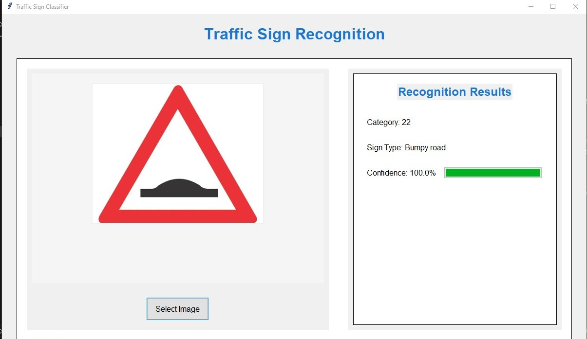
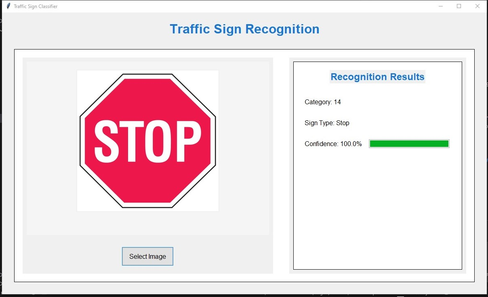
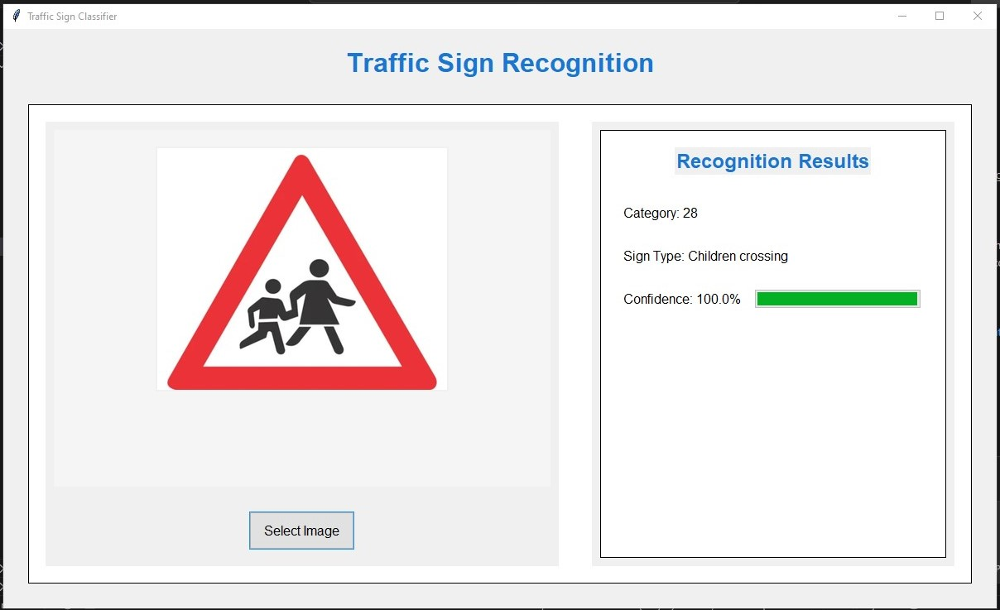

# Traffic Sign Recognition System

A Python-based traffic sign recognition system using TensorFlow and OpenCV, featuring a modern GUI interface built with Tkinter.

## Overview

This project implements a real-time traffic sign recognition system capable of identifying 43 different types of traffic signs. The system uses a convolutional neural network (CNN) trained on the German Traffic Sign Recognition Benchmark (GTSRB) dataset.

## Features

- Modern, user-friendly GUI interface
- Real-time image processing and classification
- Support for multiple image formats
- Confidence score visualization
- Detailed sign classification information

## Implementation Details

The system uses a CNN model trained using TensorFlow, with the following key components:
- Input image size: 30x30 pixels
- 43 different traffic sign classes
- Image preprocessing for consistent input sizing
- Confidence score calculation

## Experimentation Process

During the development of this project, several approaches and techniques were explored:

### Model Architecture Experiments
- Initially started with a basic CNN architecture
- Experimented with different layer configurations and dropout rates
- Found that deeper networks didn't necessarily perform better due to the relatively small input size
- The final model architecture achieved the best balance between accuracy and performance

### Image Processing Challenges
- Initially faced issues with varying image sizes and orientations
- Implemented a centered scaling approach that preserves aspect ratio
- Experimented with different preprocessing techniques:
  - Direct resizing (led to distortion)
  - Padding + resizing (better results)
  - Center crop + resize (worked well for clearly centered signs)
- The final solution uses a combination of aspect ratio preservation and centered placement

### GUI Development Journey
- Started with a basic Tkinter interface
- Added progressive enhancements:
  - Modern styling and color scheme
  - Progress bar for confidence visualization
  - Responsive layout
- Improved user feedback during image processing

## Results

Here are some successful recognition examples:


*Example of bumpy road sign recognition with high confidence*


*Successful recognition of stop sign in varying light conditions*


*Accurate classification of Children Crossing sign with confidence score*

## Lessons Learned

- Preprocessing is crucial for model performance
- Balancing model complexity with input size is important
- User interface feedback significantly improves user experience
- Image aspect ratio preservation is key for accurate recognition
- Real-time processing requires optimization considerations

## Future Improvements

- Add support for video input
- Implement batch processing capability
- Add model retraining capability
- Enhance preprocessing for better handling of poor lighting conditions
- Add support for multiple simultaneous sign detection

## Getting Started

1. Install required dependencies:
```bash
pip install tensorflow opencv-python pillow
```

2. Run the application:
```bash
python predict_sign.py
```

Note: Make sure you have the model file `best_model.h5` in the same directory as the script.
